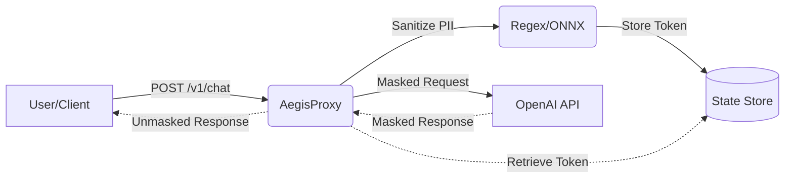

<div align="center">
  <h1>🛡️ AegisProxy</h1>
  <p><strong>High-Performance AI Data Firewall & Reverse Proxy</strong></p>
  
  [](https://goreportcard.com/report/github.com/Cristofervaltz/AegisProxy)
  [](https://github.com/Cristofervaltz/AegisProxy/actions)
  [](https://opensource.org/licenses/MIT)
</div>

<br>

**AegisProxy** is a lightweight, blazing-fast reverse proxy written in **Go**. It is designed to sit between your corporate network and external LLM APIs (such as OpenAI), acting as a privacy firewall. 

Its primary mission is to intercept requests, detect Personally Identifiable Information (PII) like names, emails, credit cards, and API keys, and **mask** them before they ever leave your infrastructure. When the AI responds, AegisProxy seamlessly **unmasks** the tokens back to their original values. The LLM provider never sees your sensitive data.

---

## ✨ Features

- **Zero Data Leakage:** Replaces PII with secure tokens (e.g., `[EMAIL_1]`) on the fly.
- **Bi-directional Mapping:** Restores the masked data in the LLM's response automatically.
- **Streaming Support:** Fully supports `stream: true` (Server-Sent Events) with zero buffering delay.
- **Dynamic Rules Engine:** Add new Regex masking rules in real-time without restarting the proxy.
- **Distributed State:** Supports both `In-Memory` caching (for single-node speed) and `Redis` (for horizontal scaling).
- **Observability:** Built-in Prometheus metrics and JSON structured logging.
- **Admin Dashboard:** Embedded web UI to monitor metrics and manage masking rules.

---

## 🏗 Architecture



---

## 🚀 Quick Start

The easiest way to run AegisProxy is via Docker Compose. This will spin up the proxy and a Redis instance automatically.

### Prerequisites
- Docker & Docker Compose

### Running the stack
```bash
git clone https://github.com/Cristofervaltz/AegisProxy.git
cd AegisProxy
docker compose up --build
```
*The proxy will be available on `http://localhost:8080` and the Admin UI on `http://localhost:9090`.*

---

## 🛠️ Usage (OpenAI Drop-in)

Simply point your OpenAI client to AegisProxy instead of `api.openai.com`.

```bash
curl http://localhost:8080/v1/chat/completions \
  -H "Content-Type: application/json" \
  -H "Authorization: Bearer YOUR_OPENAI_KEY" \
  -d '{
    "model": "gpt-3.5-turbo",
    "messages": [
      {
        "role": "user",
        "content": "My secret email is ceo@company.com and my credit card is 4532 1111 2222 3333. Keep this safe!"
      }
    ]
  }'
```

**What OpenAI sees:**
> *"My secret email is `[EMAIL_1]` and my credit card is `[CREDIT_CARD_2]`. Keep this safe!"*

**What you receive back:**
> *"I understand. I will keep your email (ceo@company.com) and your card (4532 1111 2222 3333) perfectly safe."*

---

## 📊 Admin Dashboard & Metrics

AegisProxy ships with a built-in administration panel on port `9090`.

- **Web Dashboard:** Visit `http://localhost:9090/` to view and add new Regex masking rules on the fly.
- **Prometheus Metrics:** Scrape `http://localhost:9090/metrics` to monitor traffic, latency, and the number of PII tokens successfully masked.

---

## 🗺️ Roadmap

- [x] MVP Testing & Git Flow
- [x] Distributed Storage (Redis)
- [x] Streaming Support (SSE)
- [x] CI/CD Pipeline & Dockerization
- [x] Observability (Prometheus & slog)
- [ ] ONNX Runtime Integration (for SLM-based Named Entity Recognition instead of Regex)

## 📄 License

This project is licensed under the MIT License - see the [LICENSE](LICENSE) file for details.
