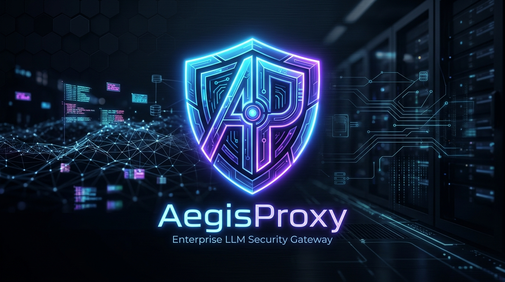

<div align="center">
  
  
  <h1>🛡️ AegisProxy</h1>
  <p><b>Enterprise-grade LLM Security Gateway & PII Sanitizer</b></p>

  [](https://pkg.go.dev/github.com/Cristofervaltz/AegisProxy)
  [](https://github.com/Cristofervaltz/AegisProxy/actions)
  [](https://opensource.org/licenses/MIT)

  <p>Protect your sensitive corporate data before it reaches public LLMs.</p>
</div>

---

## 🌟 Overview

**AegisProxy** is a high-performance, drop-in proxy server that sits between your applications and LLM providers (like OpenAI, Anthropic, and Google Gemini). It intercepts API requests, automatically detects and masks Personally Identifiable Information (PII) using Machine Learning (ONNX) and regular expressions, and injects secure API keys from HashiCorp Vault.

When the LLM responds, AegisProxy flawlessly restores the original data before returning it to the client. The LLM never sees your secrets, and your application never knows it was masked.

## ✨ Features

- **🌐 Multi-Provider Support**: Seamlessly proxy requests to **OpenAI**, **Anthropic (Claude 3)**, and **Google (Gemini)**.
- **🧠 Context-Aware Masking (ML)**: Uses on-device ONNX models (`distilbert-ner`) to detect context-based PII (Names, Organizations, Addresses) that regex would miss.
- **⚡ High-Performance Rate Limiting**: Protect your APIs from abuse with token-bucket rate limiting backed by Redis or In-Memory stores.
- **🔐 Secure Key Storage**: Native integration with **HashiCorp Vault** to dynamically inject provider API keys. Clients no longer need to handle secrets.
- **📊 Real-time Audit Logging**: Tracks token usage, latency, IP addresses, and masked PII counts in structured JSON for billing and compliance.
- **🔌 Drop-in Replacement**: Works instantly with existing OpenAI/Anthropic/Gemini SDKs. Just change the Base URL!

---

## 🚀 Quick Start

The fastest way to get AegisProxy running is using Docker Compose. It will automatically spin up the Proxy, a Redis instance (for rate limiting), and HashiCorp Vault (for key storage).

### 1. Clone the repository
```bash
git clone https://github.com/Cristofervaltz/AegisProxy.git
cd AegisProxy
```

### 2. Configure Environment (Optional)
By default, the proxy runs on port `8080`. You can pass direct API keys if you aren't using Vault:
```bash
export OPENAI_API_KEY="sk-..."
export ANTHROPIC_API_KEY="sk-ant-..."
export GEMINI_API_KEY="AIzaSy..."
```

### 3. Start the Stack
```bash
docker compose up --build -d
```
*Note: On first startup, the proxy will download a ~250MB ONNX ML model for PII masking.*

---

## 💻 Usage (Client Side)

AegisProxy acts as a transparent reverse proxy. Simply point your existing LLM clients to `http://localhost:8080`.

### Example: Proxying to OpenAI
Notice we send the request to `localhost:8080` instead of `api.openai.com`. You don't even need to send an API key if it's configured in Vault!

```bash
curl -X POST http://localhost:8080/v1/chat/completions \
  -H "Content-Type: application/json" \
  -d '{
    "model": "gpt-4",
    "messages": [
      {
        "role": "user",
        "content": "My name is John Doe, and my credit card is 4532 1234 5678 9012. Is it valid?"
      }
    ]
  }'
```

**What the LLM sees:**
> "My name is [PERSON_1], and my credit card is [CREDIT_CARD_1]. Is it valid?"

**What your application gets back:**
> "Yes, John Doe, the credit card 4532 1234 5678 9012 appears to be valid."

### Example: Proxying to Anthropic
AegisProxy automatically detects the `/v1/messages` path and routes it to Anthropic.

```bash
curl -X POST http://localhost:8080/v1/messages \
  -H "Content-Type: application/json" \
  -H "anthropic-version: 2023-06-01" \
  -d '{
    "model": "claude-3-opus-20240229",
    "max_tokens": 1024,
    "messages": [
      {"role": "user", "content": "Email me at ceo@company.com"}
    ]
  }'
```

---

## 🏗️ Architecture

AegisProxy is built with a highly extensible **Adapter Pattern**:
- **ProxyHandler** intercepts requests and matches the URL path.
- **Provider Adapters** (OpenAI, Anthropic, Gemini) parse the unique JSON structures, extract the text, and pass it to the **Sanitizer Engine**.
- **Sanitizer Engine** runs Regex and ONNX Extractors concurrently. It maps PII to safe tokens (e.g., `[EMAIL_1]`).
- The adapter reconstructs the JSON and forwards it to the real LLM.
- On response, the process runs in reverse.

---

## 🛠️ Configuration

Configure the proxy using Environment Variables:

| Variable | Default | Description |
|---|---|---|
| `PORT` | `:8080` | Port to run the proxy on |
| `STORE_TYPE` | `memory` | `redis` or `memory` for rate limit state |
| `REDIS_ADDR` | `localhost:6379` | Address of Redis server |
| `RATE_LIMIT_RPS` | `10` | Allowed requests per second per IP |
| `RATE_LIMIT_BURST` | `20` | Max burst of requests allowed per IP |
| `VAULT_ADDR` | `http://localhost:8200` | HashiCorp Vault Address |
| `VAULT_TOKEN` | `root` | Vault access token |

---

## 📈 Audit Logging
All requests are securely logged to `logs/audit.log` in JSONL format for easy ingestion into Elasticsearch, Splunk, or Datadog.

```json
{"timestamp":"2026-08-01T23:45:12Z","client_ip":"192.168.1.5","model":"gpt-4","duration_ms":1450,"prompt_tokens":45,"completion_tokens":120,"total_tokens":165,"pii_tokens_masked":2}
```

---

## 🤝 Contributing
Contributions are welcome! Please open an issue or submit a pull request for new Provider Adapters, better ML models, or caching layers.

## 📄 License
This project is licensed under the MIT License - see the LICENSE file for details.
